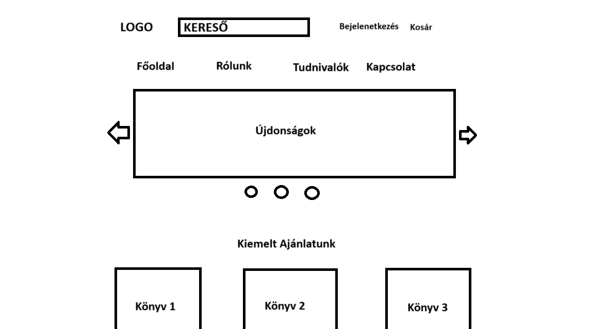

# Funkcionális Specifikáció

## 1. Jelenlegi helyzet leírása

Napjainkban számos könyves weboldal és webshop elavulttá vált: sok esetben rendszerezetlenek és nehezen átláthatók a felhasználók számára. Az érdeklődés egyre inkább a modern, letisztult, és könnyen kezelhető felületek felé fordul, miközben a régebbi webshopokat gyakran elhanyagolják, és nem fejlesztik tovább. Emiatt ezek az oldalak egyre kevésbé képesek versenyképesen részt venni az online kereskedelemben, és annak ellenére, hogy egykor megbízhatónak számítottak, nehezen tartják meg a közönségüket. Az elmúlt években az ilyen webshopok és kínálatuk iránti érdeklődés érezhetően csökkent, ami hatással van a bevételeikre, valamint a könyvek kiadására és nyomtatására. A régi oldalak modernizálása azonban várhatóan lendületet adna a forgalmuknak, és ez a helyzet kiváló lehetőséget nyújt a könyves weboldalak és webshopok számára, hogy újraépítsék kapcsolatukat az olvasóközönséggel, és fokozzák a könyvek iránti érdeklődést. Ugyanakkor fontos, hogy a közönség igényeinek változását folyamatosan figyelemmel kísérjék, és ezekhez igazodva alakítsák weboldalaikat. Az elavult webshopok számára az alkalmazkodás kulcsfontosságú, hiszen az új technológiák és trendek bevezetésével képesek lehetnek megőrizni versenyképességüket és fennmaradásukat az online piacon.

## 2. Vágyálom rendszer 

Célunk egy olyan könyves webshop létrehozása, amely a különböző kiadók általi köteteket egy helyről beszerezhetővé, megvásárolhatóvá tegye, illetve amely könnyen kezelhető, áttekinthető felületet biztosít a vásárlóknak. A kínálatban szereplő termékek kimagasó minőségűek, a gondos csomagolásuk miatt pedig sérülésmentesen érkezhetnek meg vásárlóinkhoz.
Az oldal megjelenése és stílusa modern és letisztult, a felületen könnyen el lehet igazodni. A vásárlók által egy közösséget is kialakíthatunk, ahol az olvasók leírhatják és megoszthatják a véleményüket az adott könyvről. A felhasználókak lehetőséget nyújtunk arra, hogy kedvenc köteteik mellé beszerezhessék az általuk kedvelt könyves termékeiket, mint például a bögre és a vászontáska, amiken közkedvelt idézetek szerepelhetnek könyvekből.
A regisztrált felhasználók személyre szabhatják profilukat, illetve megrendeléseiket nyomon tudják követni. Az előrendelt könyvek megjelenéséről azonnal értesítést kaphatnak, illetve az akciókról is.

## 3. Jelenlegi üzleti folyamatok modellje

A könyves tartalommal szolgáló oldalak vagy webáruházak különleges piaci réteget szolgálnak ki. Ezen webshopok általában különféle kiadók által vannak fenntartva, így a vásárlónak több oldalról szükséges rendelnie abban az esetben, ha az általa megvásárolni kívánt könyveket más és más kiadók forgalmazzák.

A könyves webshopok napjainkban igazán különleges helyet foglalnak el az online vásárlás és piac világában, ennek okai:

- Célcsoport: A könyves webshopok azokat a vásárlókat célozzák első sorban, akik érdeklődnek a könyvek iránt, szeretnek olvasni vagy akár érdekeltek a friss megjelenésű könyvek iránt.
- Könyves termékek: Különféle könyvek mellett lehetőség van olyan termékek vásárlására is, amik könyvekhez kapcsolódhatnak. Ilyen például vászontáska vagy bögre, amin egy kedvelt idézet szerepel.
- Akciók és raktárvásár: A közeli megjelenésű kötetek akciósan előrendelhetőek, ez addig él, amíg meg nem jelenik országosan az adott könyv. A raktárvásár elindulásától a készlet erejéig különféle kedvezmények várják a vásárlókat, akár kisebb szépséghibás kötetek is beszerezhetőek kedvező áron.

Piaci szerep:

- Piachelyzet: A könyveket forgalmazó webshopok napjainkban sokak által látogatottak, közkedvelt az olvasni vágyók körében.
- Vásárlás: Lehetővé teszik ezek az áruházak, hogy olyan könyveket vásárolhassunk, amik évekkel korábban megjelentek vagy akár még csak a közeljövőben van a megjelenésük.
- Egyszerűség: A webshopon könnyen el lehet igazodni, az ajándéktárgyakon kívül csak könyveket értékesít.
- Vásárlói közösség: A webshop egyben egy közösségi felület is, ahol a vásárlók leírhatják a véleményüket a megjelent könyvekkel kapcsolatban, akár ezzel is bíztatva könyvmoly társukat a kötet beszerzésére. 

## 4. Igényelt üzleti folyamatok modellje

### Modell 

## 5. Követelménylista

| ID | Modul | Név | Kifejtés |
| :---: | --- | --- | --- |
| K1  | Weboldal | Főoldal  | Webshop főoldalának dizájnja. |
| K2  | Weboldal | Kínálat  | Webshopon kínált termékek közötti böngészés. |
| K3  | Weboldal | Felhasználó  | Regisztrációs és bejelentkező felület. |
| K4  | Weboldal | Profil  | A már regisztrált felhasználó profiljának megtekintése. |
| K5  | Weboldal | Kosár | A felhasználó itt látja illetve tudja ellenőrizni hogy mit szeretne vásárolni |
| K6  | Rendelés | Kosár tartalma | Itt látja a felhasználó a kosár tartalmát, illetve ezen a helyen tudja beaktiválni kuponját |
| K6  | Felhasználókezelés | Regisztráció  | Egy felhasználó létrehozása. |
| K7  | Felhasználókezelés | Bejelentkezés  | Egy már létrejött felhasználó bejelentkeztetése. |
| K8  | Felhasználókezelés | Profilkezelés  | Egy már létrejött felhasználó profiljának szerkesztése. |
| K9  | Keresőfunkció | Szűrés  | Egy termék bizonyos tulajdonságaira való szűrés, a gyorsabb és hatékonyabb keresés érdekében. |
| K10  | Kínálat | Értékelés | Visszajelzés az adott termékről és szerzőröl. |
| K11  | Kínálat | Termékleírás | Egy adott termékről kép, leírás(főszöveg, kategóriái, címkék, szerző, fordító, megjelenés, oldalszám, ISBN, termékelérhetőség, ára).
| K12  | Ügyintézés | Ügyfélszolgálat | Probléma esetén segítséget nyújtunk telefonon, illetve el lehet érni minket e-mailen. |
| K13  | Ügyintézés | Rendeléskövetés | Egy adott termék megvásárlása után való állapotkövetés. |
| K14  | Használati útmutató | GYIK | Gyakori kérdések a webshop működésével kapcsolatban. |

## 6. Használati esetek

1. Vásárlás: A felhasználó kiválasztja az általa megvásárolni kívánt terméket vagy termékeket, elindítja a fizetési tranzakciót és amint végrehajtódott, megtörtént a vásárlás. A megrendelését pedig nyomon követheti.
2. Kapcsolattartás: A felhasználók első sorban a könyvekre tudnak csak véleményezést írni, amivel segíthetnek egy másik vásárlónak eldönteni a kötet megvételét. A felhasználók bármilyen probléma vagy kérdés esetén kapcsolatba tudnak lépni az ügyfélszolgálattal email-en keresztül.

## 7. Megfeleltetés, hogyan fedik le a használati eseteket a követelményeket

|ID|Leírás           |
|-------------------------|---------------------------|
|K1, K2, K3| A felhasználót, amikor belép a könyves webshop online felületére, a Főoldal fogadja (K1), ahol az ajánlatok és kiemelt könyvek böngészhetők. Innen navigálhat a webshop különböző kategóriái között, amelyek a Kínálat modulban találhatók (K2), vagy használhatja a Felhasználó modult (K3) a bejelentkezéshez vagy a regisztrációhoz.|
|K4| A regisztrált felhasználók saját Profil oldalukon (K4) megtekinthetik és módosíthatják személyes adataikat, rendelési előzményeiket, és kezelhetik a beállításaikat.|
|K5, K6, K7| A felhasználók a Kosár modulban (K5) láthatják az általuk kiválasztott könyveket. Az oldal tartalmazza a kosár tartalmának kezelését is (K6), ahol a vásárlók hozzáadhatják kuponjaikat. A Felhasználókezelés modulban található a Regisztráció (K6) és a Bejelentkezés (K7) felülete, valamint a Profilkezelés modul (K8) a regisztrált profil szerkesztéséhez.|
|K8, K9| A Keresőfunkció (K9) lehetővé teszi a felhasználók számára, hogy könyveket találjanak szűrési opciók segítségével, például cím, szerző, műfaj alapján. A haladó keresés mellett szöveges és egyéb keresési módok is rendelkezésre állnak.|
|K10, K11, K12| A Kínálat modulban található Értékelés (K10) lehetőséget biztosít arra, hogy a felhasználók visszajelzést adjanak egy adott termékről és annak szerzőjéről. A Termékleírás (K11) tartalmazza a könyv részleteit, például képeket, leírást, szerzőt, fordítót, megjelenési adatokat, ISBN-t, és az árát. A vásárlók kérdéseik és problémáik esetén igénybe vehetik az Ügyfélszolgálat modulját (K12), amely elérhető telefonon és e-mailben is.|
|K13| A vásárlás után a Rendeléskövetés modul (K13) segítségével a felhasználó nyomon követheti a megvásárolt könyvek állapotát és szállítási folyamatát.|
|K14| A webshop GYIK szekciójában (K14) a felhasználók válaszokat találhatnak a leggyakrabban felmerülő kérdésekre, például a rendelés menetével, fizetési opciókkal és szállítással kapcsolatban.|

## 8. Képernyőtervek

![kepernyoterv] (../Img/.png)

## 9. Forgatókönyvek

Vendég üdvözlő oldal és főoldal:
 * Minden felhasználó, aki meglátogatja a webshopot, a főoldalra érkezik, ahol könyvajánlatok, promóciók és népszerű könyvek jelennek meg. A vendégek böngészhetnek a kínálat között, de vásárláshoz bejelentkezés szükséges.
Bejelentkezés:
 * A Bejelentkezés gombra kattintva a felhasználó a belépési oldalra kerül, ahol megadhatja regisztrált adatait. Sikeres bejelentkezés után a felhasználó visszakerül a főoldalra, immár hozzáférve a profiljához és a további funkciókhoz.
Regisztráció:
 * A Regisztráció gombra kattintva a felhasználó a regisztrációs felületre jut, ahol megadhatja személyes adatait, létrehozva egy új profilt. A regisztráció után szintén visszakerül a főoldalra, ahol bejelentkezve folytathatja a vásárlást.
Profil kezelése:
 * Bejelentkezés után a felhasználó a Profil menüpontban megtekintheti profiljával kapcsolatos opciókat, mint például:
    - Profil szerkesztése: A felhasználó itt módosíthatja személyes adatait.
    - Rendelések kezelése: A felhasználó itt megtekintheti és kezelheti korábbi és aktuális rendeléseit.
    - Üzenetek: Az üzenetek menüben megnézheti a vásárlásokhoz és eladásokhoz kapcsolódó kommunikációt.
Böngészés és keresés:
  * A felhasználók böngészhetnek a főoldalon kiemelt promóciós könyvek között.
  * A Kereső használatával kereshetnek könyvcímek, szerzők vagy műfaj alapján, illetve szűrők és hangvezérlés segítségével pontosíthatják a keresést.
Kosár:
  * A Kosár gombra kattintva megtekinthetik, milyen könyveket választottak ki vásárlásra. Itt módosíthatják a kosár tartalmát, aktiválhatnak kuponokat, vagy folytathatják a fizetési folyamatot.
Termékoldal:
  * Ha a felhasználó egy könyvre kattint, a könyv termékoldalára érkezik, ahol részletes leírást, képeket, árat és elérhetőségi információkat láthat.
  * Innen a Kosárba helyezés gombbal hozzáadhatja a könyvet a kosarához, amennyiben az elérhető, vagy az Azonnali vásárlás gombbal közvetlenül megkezdheti a vásárlási folyamatot.

## 10. Funkció - követelmény megfeleltetése

Id | Követelmény |	Funkció |
| :---: | --- | --- |
| K1 | Egyszerű, Esztétikus |	A webshop dizájnja egyszerű és felhasználóbarát, a főoldalon a legnépszerűbb könyvek és promóciók könnyen elérhetők. Az esztétika a letisztultságot tükrözi, miközben a navigáció intuitív, a termékek és kategóriák jól láthatóak és könnyen hozzáférhetők.
| K2 |	Sokszínű választék |	A webshop különféle témájú könyveket kínál. A vásárlók könnyen böngészhetnek különböző kategóriák között, mint például történelem, fantasy, vagy középkori regék.
| K3 |	Gyorsaság | A vásárlási folyamat gyors és egyszerű, a weboldal gyorsan betöltődik és válaszol a felhasználói interakciókra. A fizetés zökkenőmentes, különböző lehetőségeket kínálva, mint bankkártyás, PayPal, vagy egyszerű banki átutalás. A tranzakciók gyorsak, a rendelési visszaigazolás azonnal megtörténik.
| K4 |	Határtalan |	A webshop képes bármennyi könyvet és terméket kezelni. Akár nagy mennyiségű könyvet is feltölthetünk, és minden termék könnyedén kereshető és kategorizálható. A webshop rugalmasan kezeli a termékek folyamatos bővítését és frissítését, így biztosítva a folyamatos növekedést és a változatos választékot.

## 11. Fogalomtár
