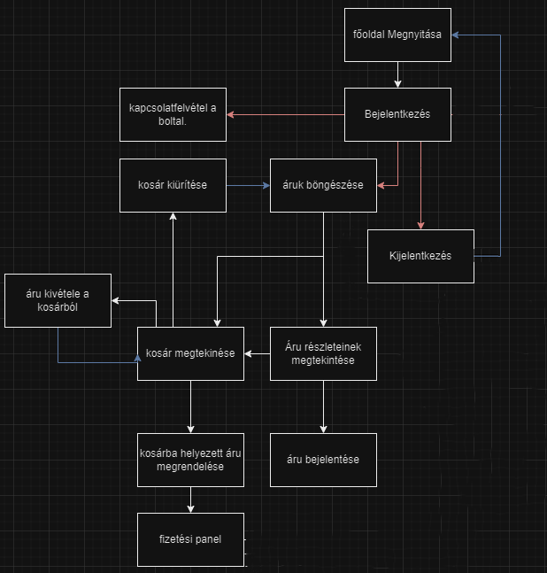

## 1. A rendszer célja

Az Eviscerate Kft. azt a megbízást kapta, hogy készítsen egy modern és letisztult stílusú webshopot, ahol a felhasználók különböző kiadók által kiadott és forgalmazott könyveket tudnak vásárolni. A webshop kitűnik a többi könyveket áruló webáruház mellett az átláthatóság, dizájn terén, illetve a könyveket akár egy helyről is beszerezhetik a vásárlók.
Az Eviscerate Kft. elkötelezett amellett, hogy a Könyvkuckó webshop kielégítse a könyvmolyok minden igényét, mindezt egy jól kezelhető felületen keresztül. Ez a projekt az általunk fejlesztett egyedi megoldásokkal fogja elősegíteni azt, hogy megkönnyítsük az olvasni vágyók életét, rengeteg kiadó kötetét egy helyre gyűjtjük össze.
Felhasználóink könnyen eligazodnak a weboldalon, a könyvek között egyszerűen tudnak keresni vagy szűrni. A vásárlás után a rendeléseket nyomon tudja követni a felhasználó, így mindig naprakészen láthatja csomagja állapotát. Oldalunk törekszik a sérülésmentes szállításra, a lehető leggondosabban csomagoljuk be a megrendelt termékeket. Sérülés esetén a felhasználó kapcsolatba léphet az ügyfélszolgálatunkkal, ahol segítőkészen segítséget nyújtanak a vásárlónak, az érintett könyvet pedig kicseréljük.

## 2. Projektterv

### 2.1 Projektszerepkörök, felelőségek

* Scrum master:
	-   Pántya Barnabás 	
* Product owner:
	-   Pántya Barnabás
* Üzleti szereplő:
	-   Megrendelő:
	    - Sarah J. Maas
   
### 2.2 Projektmunkások és felelőségek
   		
* Frontend:
	-   Hegyközi Petra
	-   Habóczki Szabolcs
* Backend:  
	-   Csonka Mihály
 	-   Vincze Ákos 
* Tesztelés:   
	-   Hegyközi Petra
	-   Vincze Ákos
	-   Habóczki Szabolcs
	-   Csonka Mihály

### 2.3 Ütemterv

### 2.4 Mérföldkövek

## 3. Üzleti folyamatok modellje

### 3.1 Üzleti szereplők

Az oldal regisztráció nélkül is használható, azonban bizonyos funkciók csak regisztrált felhasználók számára érhetők el. Az alábbiakban bemutatjuk a különböző üzleti szereplőket és az általuk elérhető szolgáltatásokat:

Vendég Felhasználók:
* Termékek megtekintése: A látogatók regisztráció nélkül is megtekinthetik az oldalon elérhető árucikkeket.
* Kosár használata: A vendégek kosárba helyezhetik az általuk kívánt termékeket, hogy később vásárlás előtt áttekintsék őket.

Regisztrált Felhasználók:
* Vásárlás: A regisztrált felhasználók képesek végrehajtani a vásárlási tranzakciókat, beleértve a fizetési lehetőségeket.
* Csomagkövetés: A vásárlók hozzáférhetnek a megrendelt termékeik státuszához és nyomon követhetik azok szállítási folyamatát.
* Árufeltöltés: A regisztrált felhasználók, amennyiben eladni kívánnak, feltölthetik saját termékeiket a webshopra. Az árucikkek feltöltéséhez és kezeléséhez regisztráció szükséges.

A regisztrált felhasználók számára a webshop további kényelmi szolgáltatásokat is biztosít, mint például a profilkezelést, rendelési előzmények megtekintését és személyre szabott ajánlásokat.

### 3.2 Üzleti folyamatok

A felhasználó regisztráció nélkül böngészhet és kosárba helyezhet termékeket, de vásárláshoz regisztráció szükséges, amely után hozzáférhet a vásárlási funkciókhoz.

## 4. Követelmények

### Funkcionális követelmények

| ID | Megnevezés               | Leírás                                                                                                                                                     |
|----|--------------------------|------------------------------------------------------------------------------------------------------------------------------------------------------------|
| K1 | Bejelentkezési oldal     | Az egyes funkciók eléréséhez előbb ezen az oldalon kell azonosítania magát a felhasználónak. |
| K2 | Termékböngésző           | A felhasználó itt láthatja a webshopon található termékek széles választékát, a terméket kosárba tudja tenni vagy el tudja érni a termékspecifikus oldalt. |
| K3 | Termékspecifikus oldal   | Ezen az oldalon a felhasználó részletesebb leírást kaphat egyes, az oldalon kapható termékekről, a terméket kosárba tudja tenni vagy akár értékelni tudja azt. |
| K4 | Kosár                    | A felhasználó ezen az oldalon láthatja az általa választott termékeket, innen tud tovább menni a rendelés leadására és befejezésére. |
| K5 | Profil oldal             | Ezen az oldalon a felhasználó a saját adatait szerkesztheti. |
| K6 | Regisztrációs oldal      | Ezen az oldalon a felhasználó meg tudja adni az adatait, amik szükségesek egyes funkciók eléréséhez. |
| K7 | Kapcsolatfelvételi oldal | A felhasználó itt tudja felvenni a kapcsolatot az ügyfélszolgálattal bármilyen kérdés esetén, legyen az rendeléssel kapcsolatos vagy megjelenéssel. |
| K8 | Csomagkövetési oldal     | Ezen az oldalon jelennek meg a felhasználó rendelései, annak állapota és a várható szállításának ideje. |

### Nemfunkcionális követelmények

| ID  | Megnevezés                             | Leírás                                                                                                 |
|-----|----------------------------------------|--------------------------------------------------------------------------------------------------------|
| K9  | Modern, letisztult oldaldizájn | Maga az oldal dizájnja, a színek és a betűk nem hivalkodóak, egyszerűen áttekinthető oldalt nyújtanak. |
| K10 | Könnyen kezelhető, átlátható felület | Az oldalak egyszerűen használhatóak, átláthatóak legyenek és ne legyenek zsúfoltak. |

## 5. Funkcionális terv

### 5.1 Rendszerszereplők

A rendszer egy szerver (host) gépen fut, melyet a felhasználók (kliensek) egy webböngészőn keresztül érhetnek el. A felhasználók között jogosultságok oszlanak meg, ezek:

| Felhasználói jogkör | Jogok                                                                                                                                                                                                                   |
|---------------------|-------------------------------------------------------------------------------------------------------------------------------------------------------------------------------------------------------------------------|
| no_login | Bejelentkezés és regisztráció, a termékek megtekintése, ügyfélszolgálat elérése |
| user     | Termékek megtekintése és vásárlása, rendelés leadása, törlése és követése, saját profil szerkesztése és törlése, értékelés írása a termékre, ügyfélszolgálat elérése |
| admin    | Termékek törlése és hozzáadása, értékelés törlése, profilok törlése, ügyfélszolgálati segítségnyújtás |
| delivery | A rendelések állapotának a módosítása |

### 5.2 Menü-hierarchia:

* Könyvkuckó Felület: 
	- Felhasználó
		- Kínálat böngészése, termékek megtekintése
		- GYIK oldal, ügyfélszolgálati elérhetőségek oldal
		- Bejelentkezés
	- Belépett felhasználó
		- Kínálat böngészése, termékek megtekintése
		- GYIK oldal, ügyfélszolgálati elérhetőségek oldal
		- Profil szerkesztése, törlése
		- Rendelés leadása, törlése
		- Értékelés írása
	- Admin felhasználó
		- Felhasználók törlése
		- Termékek törlése, hozzáadása
		- Értékelések törlése
		- Rendelések törlése
 * Futárszolgálat Felület: (csak futárszolgálatnak elérhető)
	- Az oldal csak "delivery", azaz futárszolgálatnak elérhető bejelentkezés után
 		- Rendelések áttekintése
 		- Rendelések állapotának szerkesztése

## 6. Fizikai környezet

### Vásárolt szoftverkomponensek, valamint esetleges külső rendszerek

Nincsenek vásárolt szoftverkomponensek

### Hardver topológia

Grafikus operációs rendszer, amely képes böngészőt futtatni.

### Fizikai alrendszerek

Kliensgép: A felhasználók által használt PC-k, amelyek grafikus operációs rendszerrel rendelkeznek.
Szervergép: Az adatbázis és a weboldal tárolására alkalmas. A kliensgépek a szerverrel kommunikálnak.

### Fejlesztő eszközök

- Visual Studio Code
- Webböngésző
- XAMPP (MySQL)

## 7. Architekturális terv

A felhasználóknak internetkapcsolatra és egy webböngészőre van szükségük a szolgáltatás igénybevételéhez. Az oldalt egy URL beírásával lehet elérni. A felhasználóknak nem kell az adatbázishoz közvetlenül csatlakozniuk, ezt a weboldal automatikusan megoldja.

## 8. Adatbázis terv

A webshop több különböző táblát használ a megfelelő működés érdekében, ezek: 

- *users:* Regisztrált felhasználók

| Attribútum | Típus        | Kikötések (ha van)                 | Funkció                                                   |
|------------|--------------|------------------------------------|-----------------------------------------------------------|
| user_id    | int(15)      | AUTO INCREMENT, UNSIGNED, NOT NULL | Azonosító szám, a felhasználó egyedi azonosítója          |
| username   | varchar(25)  | NOT NULL                           | A felhasználó bejelentkezési neve                         |
| email      | varchar(191) | NOT NULL                           | A felhasználó email címe                                  |
| password   | varchar(191) | NOT NULL                           | A felhasználó jelszava                                    				|
| usertype   | varchar(191) | NOT NULL                           | Felhasználó jogosultsága                                 			  |
| phone		 | varchar(25)	| NOT NULL							 | Felhasználó telefonszáma 											  |
| address	 | varchar(100) | NOT NULL                   		 | Felhasználó álltal megadott cím														  |

- *products:* A termékek táblája

| Attribútum     | Típus        | Kikötések (ha van)                 | Funkció                                                   |
|----------------|--------------|------------------------------------|-----------------------------------------------------------|
| product_id     | int(15)      | AUTO INCREMENT, UNSIGNED, NOT NULL | Azonosító szám, a termék egyedi azonosítója               |
| product_tag    | varchar(25)  | NOT NULL                           | A termék szűrő neve                                       |
| product_name   | varchar(191) | NOT NULL                           | A termék neve                                             |
| description    | TEXT         |                                    | A termék leírása                                          |
| is_unavailable | tinyint(2)   | NOT NULL                           | Logikai törlés azonosítója                                |

- *orders:* A rendelések táblája

| Attribútum  | Típus        | Kikötések (ha van)                 | Funkció                                                   |
|-------------|--------------|------------------------------------|-----------------------------------------------------------|
| order_id    | int(15)      | AUTO INCREMENT, UNSIGNED, NOT NULL | Azonosító szám, a rendelés egyedi azonosítója             |
| product_id  | int(15)      | NOT NULL                           | A termék azonosítója                                      |
| buyer_id    | int(15)      | NOT NULL                           | A vevő azonosítója                                        |
| status      | varchar(30)  | NOT NULL                           | A rendelés állapota                                       |
| delivery_id | int(15)      |                                    | A futátszolgálat azonosítója, ha a státsuz megfelelő      |

## 9. Implementációs terv

Laravel kezeli a backend-et, a frontend-et pedig JavaScript, CSS és PHP.

## 10. Tesztterv

Tesztelés végrehajtása:
A teszteket a fejlesztői csapat minden tagja elvégzi, biztosítva ezzel a különböző nézőpontok és tapasztalatok figyelembevételét.
A tesztek eredményeit a tagok dokumentálják külön fájlokban, ezáltal nyomon követhetővé téve a tesztelési folyamatot.

Szoftver működésének ellenőrzése:
A tesztelés során a szoftver megfelelő működését vizsgáljuk. Az elvárt eredmények alapján a teszt eseteket sikeresnek vagy sikertelennek minősítjük.
Amennyiben az elvártnak megfelelő eredményt kapunk, a teszt eset sikeresnek tekinthető.

Ellenkező esetben a hibát rögzítjük a teszt jegyzőkönyvben, amely tartalmazza a hiba leírását és a reprodukálás lépéseit.
Hibajavítás és újbóli tesztelés:
A megtalált hibákat javítjuk a szoftverben, és azután a javításokat újbóli tesztelésnek vetjük alá, hogy biztosítsuk a hiba kiküszöbölését és a rendszer stabilitását.

Környezetek és platformok:
A tesztelés során különböző operációs rendszereken (iOS, Android, Windows) és böngészőkben (Chrome, Firefox, Opera, Safari, Brave) vizsgáljuk az oldal megfelelő működését.
Ezzel biztosítjuk, hogy a webshop minden felhasználó számára, függetlenül a használt eszköztől, zökkenőmentes élményt nyújtson.

## 11. Telepítési terv

A webshop eléréséhez csupán egy internetkapcsolattal rendelkező eszköz szükséges, amely támogatja az internetböngészést. Az alábbi operációs rendszerek és böngészők mindegyike kompatibilis a webshop használatával:

Operációs rendszerek: iOS, Android, Linux, Windows, macOS
Böngészők: Chrome, Firefox, Opera, Safari, Brave, Edge, és más modern böngészők

Az oldal minden eszközön és platformon elérhető, biztosítva a zökkenőmentes felhasználói élményt.

## 12. Karbantartási terv

Fontos ellenőrizni:
*	Az oldal kritikus információi nem lehetnek elérhetőek az arra nem felhatalmazott felhasználók számára, ilyenek például a bejelentkezési adatok, a fizetési adatok.
*	Felhasználói értékeléseket csak az admin törölheti.
*	A termékek hozzáadására és törlésére csak az adminnak lehet jogosultsága.
